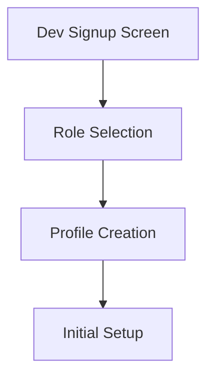
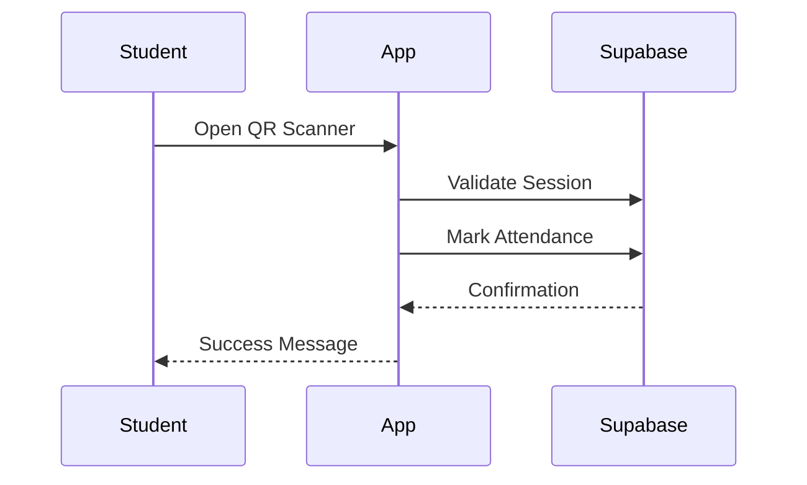
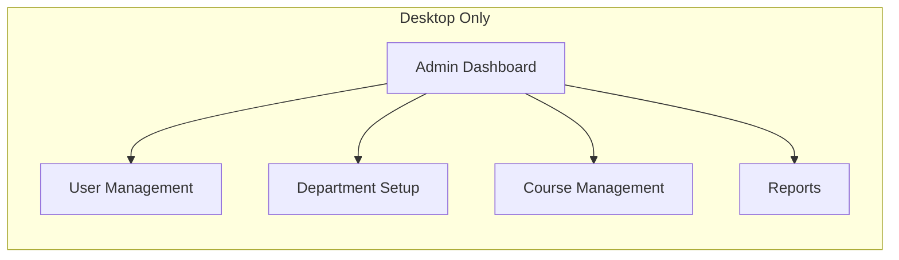

# Updated Implementation Plan

## Core Components (Completed)
- Authentication & User Management
- Theme and Shared Widgets
- Supabase Integration
- Navigation System

## Teacher Features (Completed)
- Session Management
- QR Code Generation
- Attendance Tracking
- Course Overview

## Development Auth Features (Next)



### Development Authentication
- Create dev signup screen for testing
- Allow role selection (teacher/student)
- Basic profile setup
- Test data generation
- Development-only routes and guards

## Student Features (Mobile)



### Student Module Components
- QR Code Scanner
- Attendance History
- Course Schedule View
- Profile Management
- Absence Justification Requests

## Admin Features (Desktop Only)



### Admin Desktop Application
- Separate desktop-optimized layout
- Platform-specific features
- Enhanced data management tools
- Advanced reporting capabilities

### Admin Module Features
1. User Management
   - Create/Edit Users
   - Role Assignment
   - Bulk User Import

2. Academic Structure
   - Department Management
   - Course Configuration
   - Group Assignment

3. Reporting
   - Attendance Reports
   - Student Performance
   - Course Statistics

### Desktop-Specific Considerations
- Responsive to larger screens
- Keyboard shortcuts
- Multiple window support
- Enhanced data tables
- Bulk operations
- Export capabilities

## Technical Implementation Plan

1. Dev Auth Phase
   - Create development signup screen
   - Implement role selection
   - Add development routes
   - Create test data utilities

2. Student Mobile Phase
   - Implement QR scanner
   - Build attendance history view
   - Add course schedule
   - Create justification system

3. Admin Desktop Phase
   - Create desktop-optimized layouts
   - Implement data management features
   - Build reporting system
   - Add bulk operations support

## Development Workflow

1. Complete Dev Auth
   ```
   - Create signup screen
   - Add role selection
   - Implement profile setup
   - Add development guards
   ```

2. Implement Student Features
   ```
   - QR scanner integration
   - Attendance tracking
   - Course view
   - Profile management
   ```

3. Build Admin Desktop
   ```
   - Desktop UI framework
   - Data management tools
   - Reporting system
   - User administration
   ```

## Testing Strategy

- Development Testing
  - Test account creation
  - Role switching
  - Profile management

- Student Features
  - QR scanning
  - Attendance marking
  - History viewing

- Admin Features
  - Data operations
  - User management
  - Report generation

## Implementation Notes

- The admin interface will be optimized for desktop use only
- Student and teacher features will be mobile-first
- Development signup will be protected behind feature flags
- Separate routing for desktop admin interface