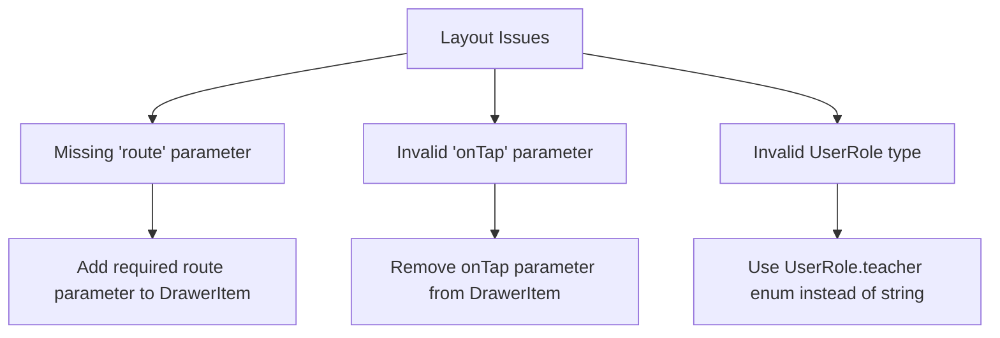
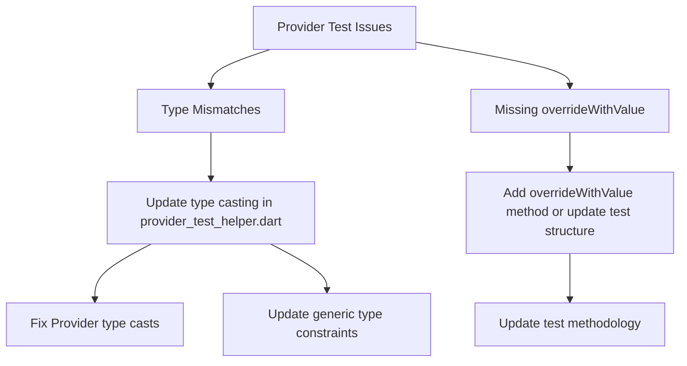
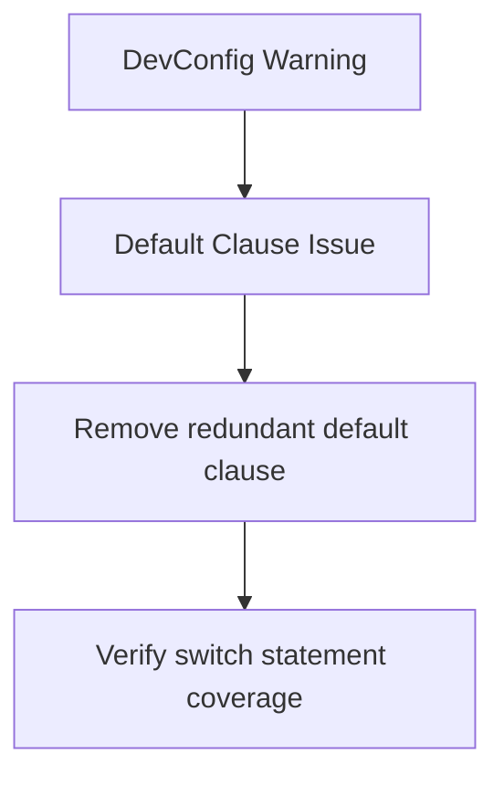

# Workspace Problem Fixes

## 1. Layout Issues (High Priority)

Both teacher and student layouts have similar problems that need to be addressed:

### Fix Steps
1. Remove `onTap` parameter from drawer items since navigation is handled inside the AppDrawer widget
2. Add required `route` parameter to each DrawerItem
3. Use `UserRole.teacher` and `UserRole.student` enums instead of strings

## 2. Provider Test Issues (Medium Priority)

### Fix Steps
1. Update provider test helper to handle type casting correctly
2. Implement or fix `overrideWithValue` method
3. Update test structure to match provider types

## 3. DevConfig Warning (Low Priority)

## 4. Misc Issues (Low Priority)

1. Remove unused `timeFormat` variable in sessions_list_screen.dart
2. Fix undefined `supabaseServiceProvider` in create_session_screen.dart
3. Remove unused import in mock_providers.dart
4. Fix setter override warning in qr_scan_screen_test.dart

## Implementation Plan

### First Pass - Layout Fixes
1. Update DrawerItem class and its usage in teacher and student layouts
2. Fix UserRole type issues
3. Test navigation functionality

### Second Pass - Test Infrastructure
1. Refactor provider test helpers
2. Update async test helper
3. Fix test type mismatches
4. Verify test coverage

### Third Pass - Cleanup
1. Remove unused code
2. Fix warnings
3. Update documentation